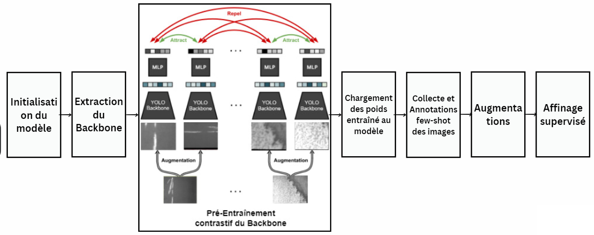

# SSL-YOLO

## Description
SSL-YOLO is a project that employs an auto-supervised approach to pretrain the backbone of the YOLOv8 model. This is achieved using contrastive representation learning, for the context of Few-Shot Object Detection.

The pipeline of our methodology can be visualized in the figure below:


## Prerequisites
- Python
- PyTorch framework

## Setup & Usage

### 1. Install Dependencies
To set up the necessary environment, run the following command:
```bash
pip install -r requirements.txt
```

### 2. Prepare the Pretraining Dataset
Ensure you possess a large, non-annotated dataset. For optimal results, use a dataset that is contextually oriented.
Update the PATH in the `ssl_training.py` file.

### 3. Setup the 10-shot Dataset
This annotated dataset should contain around only 10 images per class and in YOLO format. It will be used during the fine-tuning phase.
Update the PATH in the `fine_tune.py` file.

### 3. Run Training Script

Execute the `submit_venv.sh` script. This script will perform the following actions:

- **Execute `extract_back.py` Script for extracting the model's backbone.**:
Ensure to adjust `yolov8l.yaml` to define the number of target classes.
  
- **Execute `ssl_training.py` Script for Self supervised Training with Contrastive Learning.**: 
It's advised to utilize a larger batch size to increase the number of negative samples seen in each cycle for better generalization. 
A greater number of epochs is also beneficial.
  
- **Execute `fine_tune.py` Script for Fine-tuning on the 10-shot Dataset.**: 
After the necessary adjustments to `ultralytics/yolo/engine/trainer.py`, the solution will load the pretrained backbone's weights into the YOLOv8 model and freeze them. The model will then train on the 10-shot dataset.

